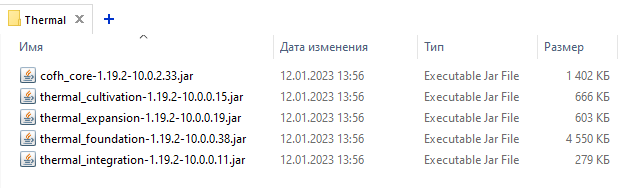

# ModCollector
[RU] Этот скрипт собирает моды из папки Ввод и ее вложенных папок и помещает их в папку Вывод.  
[EN] This script collects mods from the Input folder and its subfolders, and puts them in the Output folder

---

## Tray icon


## Tray Menu


## Tray Submenu


---
# Example
#### Folder Input: bundles
#### Folder Output: mods

## Folder Input


## Folder for global mods (subfolder of folder input)


## Folder for mod Thermal Expansion (subfolder of folder global)


## Folder Output

---
# Folder structure

Folder Input (bundles)
```bash
├───additions
│   │   3dskinlayers-forge-1.5.2-mc1.19.1.jar
│   │   AkashicTome-1.6-22.jar
│   │   almostunified-forge-1.19.2-0.3.3.jar
│   │   Fallingleaves-1.19.1-1.3.1.jar
│   │   polymorph-forge-0.46.1+1.19.2.jar
│   │   veinmining-forge-1.0.1+1.19.2.jar
│   │
│   └───Artifacts
│           artifacts-1.19.2-5.0.1.jar
│           curios-forge-1.19.2-5.1.1.0.jar
│
├───global
│   │   AE2-Things-1.1.0-beta.jar
│   │   appliedenergistics2-forge-12.9.1.jar
│   │   assemblylinemachines-1.19.2-1.4.11.jar
│   │   create-1.19.2-0.5.0.g.jar
│   │   Cyclic-1.19.2-1.7.14.jar
│   │   FluxNetworks-1.19.2-7.1.2.11.jar
│   │   GatewaysToEternity-1.19.2-3.1.1.jar
│   │   ImmersiveEngineering-1.19.2-9.1.0-156.jar
│   │   ironchest-1.19.2-14.2.7.jar
│   │   ironfurnaces-1.19.2-3.6.4.jar
│   │   Mekanism-1.19.2-10.3.5.473.jar
│   │   MekanismGenerators-1.19.2-10.3.5.473.jar
│   │   mob_grinding_utils-1.19.2-0.4.46.jar
│   │   pneumaticcraft-repressurized-1.19.2-4.2.0-16.jar
│   │   Powah-4.0.6.jar
│   │   reap-1.19.2-1.0.0.jar
│   │   SolarFluxReborn-1.19.2-19.3.7.jar
│   │
│   ├───Apotheosis
│   │       Apotheosis-1.19.2-6.0.2.jar
│   │       Placebo-1.19.2-7.1.1.jar
│   │
│   ├───Botania
│   │       Botania-1.19.2-436-FORGE.jar
│   │       Patchouli-1.19.2-77.jar
│   │
│   ├───DarkUtilities
│   │       DarkUtilities-Forge-1.19.2-13.1.7.jar
│   │       PigPen-Forge-1.19.2-11.1.2.jar
│   │       Runelic-Forge-1.19.2-14.1.2.jar
│   │
│   ├───EnderStorage
│   │       CodeChickenLib-1.19.2-4.3.0.470-universal.jar
│   │       EnderStorage-1.19.2-2.10.1.181-universal.jar
│   │
│   ├───ExtremeReactors2
│   │       ExtremeReactors2-1.19.2-2.0.55.jar
│   │       ZeroCore2-1.19-2.1.26.jar
│   │
│   ├───MysticalAgriculture
│   │       Cucumber-1.19.2-6.0.3.jar
│   │       MysticalAgradditions-1.19.2-6.0.2.jar
│   │       MysticalAgriculture-1.19.2-6.0.5.jar
│   │       MysticalCustomization-1.19.2-4.0.1.jar
│   │
│   ├───Quark
│   │       AutoRegLib-1.8.2-55.jar
│   │       Quark-3.3-377.jar
│   │
│   ├───Sophisticatedbackpacks
│   │       sophisticatedbackpacks-1.19.2-3.18.40.775.jar
│   │       sophisticatedcore-1.19.2-0.5.37.198.jar
│   │
│   └───Thermal
│           cofh_core-1.19.2-10.0.2.33.jar
│           thermal_cultivation-1.19.2-10.0.0.15.jar
│           thermal_expansion-1.19.2-10.0.0.19.jar
│           thermal_foundation-1.19.2-10.0.0.38.jar
│           thermal_integration-1.19.2-10.0.0.11.jar
│
├───optimization
│   │   AI-Improvements-1.19-0.5.1.jar
│   │   Clumps-forge-1.19.2-9.0.0+14.jar
│   │   configured-2.0.1-1.19.2.jar
│   │   Controlling-forge-1.19.2-10.0+7.jar
│   │   ferritecore-5.1.0-forge.jar
│   │   notenoughcrashes-4.2.1+1.19.2-forge.jar
│   │   oculus-mc1.19.2-1.2.8a.jar
│   │   okzoomer-forge-1.19-2.1.1.jar
│   │   rubidium-0.6.2.jar
│   │
│   └───Fast
│           FastFurnace-1.19.2-7.0.0.jar
│           FastWorkbench-1.19.2-7.0.1.jar
│
├───ui
│   │   appleskin-forge-mc1.19-2.4.2.jar
│   │   BetterPingDisplay-1.19-1.1.jar
│   │   catalogue-1.7.0-1.19.2.jar
│   │   eatinganimation-1.19-3.1.0.jar
│   │   invhud.forge.1.19-3.4.7.jar
│   │   Jade-1.19.1-forge-8.7.0.jar
│   │   MouseTweaks-forge-mc1.19-2.23.jar
│   │   notenoughanimations-forge-1.6.2-mc1.19.2.jar
│   │   overloadedarmorbar-1.19.2-7.jar
│   │   shutupexperimentalsettings-1.0.5.jar
│   │   starlight-1.1.1+forge.cf5b10b.jar
│   │
│   ├───AmbientSounds
│   │       AmbientSounds_FORGE_v5.2.13_mc1.19.2.jar
│   │       CreativeCore_FORGE_v2.9.3_mc1.19.2.jar
│   │
│   ├───EnchantmentDescriptions
│   │       Bookshelf-Forge-1.19.2-16.2.16.jar
│   │       EnchantmentDescriptions-Forge-1.19.2-13.0.14.jar
│   │
│   ├───ImprovableSkills
│   │       HammerLib-1.19.2-19.3.46.jar
│   │       ImprovableSkills-1.19.2-19.2.6.jar
│   │
│   ├───JEI
│   │       architectury-6.4.62-forge.jar
│   │       cloth-config-8.2.88-forge.jar
│   │       JustEnoughResources-1.19.2-1.1.0.179.jar
│   │       REIPluginCompatibilities-forge-9.0.44.jar
│   │       RoughlyEnoughItems-9.1.580.jar
│   │
│   ├───Trashslot
│   │       balm-4.5.3.jar
│   │       trashslot-forge-1.19-12.0.0.jar
│   │
│   └───XaerosMinimap
│           XaerosWorldMap_1.28.7_Forge_1.19.1.jar
│           Xaeros_Minimap_22.17.0_Forge_1.19.1.jar
│
└───world
    │   DungeonCrawl-1.19-2.3.11.jar
    │   DungeonsArise-1.19.2-2.1.54-release.jar
    │   mvs-3.1.6-1.19.2.jar
    │   SereneSeasons-1.19.2-8.1.0.24.jar
    │
    ├───BiomesOPlenty
    │       BiomesOPlenty-1.19.2-17.1.1.162.jar
    │       TerraBlender-forge-1.19.2-2.0.1.128.jar
    │
    └───Yungs
            YungsApi-1.19.2-Forge-3.8.2.jar
            YungsBetterDungeons-1.19.2-Forge-3.2.2.jar
            YungsBetterMineshafts-1.19.2-Forge-3.2.0.jar
            YungsBetterOceanMonuments-1.19.2-Forge-2.1.0.jar
            YungsExtras-1.19.2-Forge-3.1.0.jar
```

Folder Output (mods)
```bash
    3dskinlayers-forge-1.5.2-mc1.19.1.jar
    AE2-Things-1.1.0-beta.jar
    AI-Improvements-1.19-0.5.1.jar
    AkashicTome-1.6-22.jar
    almostunified-forge-1.19.2-0.3.3.jar
    AmbientSounds_FORGE_v5.2.13_mc1.19.2.jar
    Apotheosis-1.19.2-6.0.2.jar
    appleskin-forge-mc1.19-2.4.2.jar
    appliedenergistics2-forge-12.9.1.jar
    architectury-6.4.62-forge.jar
    artifacts-1.19.2-5.0.1.jar
    assemblylinemachines-1.19.2-1.4.11.jar
    AutoRegLib-1.8.2-55.jar
    balm-4.5.3.jar
    BetterPingDisplay-1.19-1.1.jar
    BiomesOPlenty-1.19.2-17.1.1.162.jar
    Bookshelf-Forge-1.19.2-16.2.16.jar
    Botania-1.19.2-436-FORGE.jar
    catalogue-1.7.0-1.19.2.jar
    cloth-config-8.2.88-forge.jar
    Clumps-forge-1.19.2-9.0.0+14.jar
    CodeChickenLib-1.19.2-4.3.0.470-universal.jar
    cofh_core-1.19.2-10.0.2.33.jar
    configured-2.0.1-1.19.2.jar
    Controlling-forge-1.19.2-10.0+7.jar
    create-1.19.2-0.5.0.g.jar
    CreativeCore_FORGE_v2.9.3_mc1.19.2.jar
    Cucumber-1.19.2-6.0.3.jar
    curios-forge-1.19.2-5.1.1.0.jar
    Cyclic-1.19.2-1.7.14.jar
    DarkUtilities-Forge-1.19.2-13.1.7.jar
    DungeonCrawl-1.19-2.3.11.jar
    DungeonsArise-1.19.2-2.1.54-release.jar
    eatinganimation-1.19-3.1.0.jar
    EnchantmentDescriptions-Forge-1.19.2-13.0.14.jar
    EnderStorage-1.19.2-2.10.1.181-universal.jar
    ExtremeReactors2-1.19.2-2.0.55.jar
    Fallingleaves-1.19.1-1.3.1.jar
    FastFurnace-1.19.2-7.0.0.jar
    FastWorkbench-1.19.2-7.0.1.jar
    ferritecore-5.1.0-forge.jar
    FluxNetworks-1.19.2-7.1.2.11.jar
    GatewaysToEternity-1.19.2-3.1.1.jar
    HammerLib-1.19.2-19.3.46.jar
    ImmersiveEngineering-1.19.2-9.1.0-156.jar
    ImprovableSkills-1.19.2-19.2.6.jar
    invhud.forge.1.19-3.4.7.jar
    ironchest-1.19.2-14.2.7.jar
    ironfurnaces-1.19.2-3.6.4.jar
    Jade-1.19.1-forge-8.7.0.jar
    JustEnoughResources-1.19.2-1.1.0.179.jar
    Mekanism-1.19.2-10.3.5.473.jar
    MekanismGenerators-1.19.2-10.3.5.473.jar
    mob_grinding_utils-1.19.2-0.4.46.jar
    MouseTweaks-forge-mc1.19-2.23.jar
    mvs-3.1.6-1.19.2.jar
    MysticalAgradditions-1.19.2-6.0.2.jar
    MysticalAgriculture-1.19.2-6.0.5.jar
    MysticalCustomization-1.19.2-4.0.1.jar
    notenoughanimations-forge-1.6.2-mc1.19.2.jar
    notenoughcrashes-4.2.1+1.19.2-forge.jar
    oculus-mc1.19.2-1.2.8a.jar
    okzoomer-forge-1.19-2.1.1.jar
    overloadedarmorbar-1.19.2-7.jar
    Patchouli-1.19.2-77.jar
    PigPen-Forge-1.19.2-11.1.2.jar
    Placebo-1.19.2-7.1.1.jar
    pneumaticcraft-repressurized-1.19.2-4.2.0-16.jar
    polymorph-forge-0.46.1+1.19.2.jar
    Powah-4.0.6.jar
    Quark-3.3-377.jar
    reap-1.19.2-1.0.0.jar
    REIPluginCompatibilities-forge-9.0.44.jar
    RoughlyEnoughItems-9.1.580.jar
    rubidium-0.6.2.jar
    Runelic-Forge-1.19.2-14.1.2.jar
    SereneSeasons-1.19.2-8.1.0.24.jar
    shutupexperimentalsettings-1.0.5.jar
    SolarFluxReborn-1.19.2-19.3.7.jar
    sophisticatedbackpacks-1.19.2-3.18.40.775.jar
    sophisticatedcore-1.19.2-0.5.37.198.jar
    starlight-1.1.1+forge.cf5b10b.jar
    TerraBlender-forge-1.19.2-2.0.1.128.jar
    thermal_cultivation-1.19.2-10.0.0.15.jar
    thermal_expansion-1.19.2-10.0.0.19.jar
    thermal_foundation-1.19.2-10.0.0.38.jar
    thermal_integration-1.19.2-10.0.0.11.jar
    trashslot-forge-1.19-12.0.0.jar
    veinmining-forge-1.0.1+1.19.2.jar
    XaerosWorldMap_1.28.7_Forge_1.19.1.jar
    Xaeros_Minimap_22.17.0_Forge_1.19.1.jar
    YungsApi-1.19.2-Forge-3.8.2.jar
    YungsBetterDungeons-1.19.2-Forge-3.2.2.jar
    YungsBetterMineshafts-1.19.2-Forge-3.2.0.jar
    YungsBetterOceanMonuments-1.19.2-Forge-2.1.0.jar
    YungsExtras-1.19.2-Forge-3.1.0.jar
    ZeroCore2-1.19-2.1.26.jar
```
